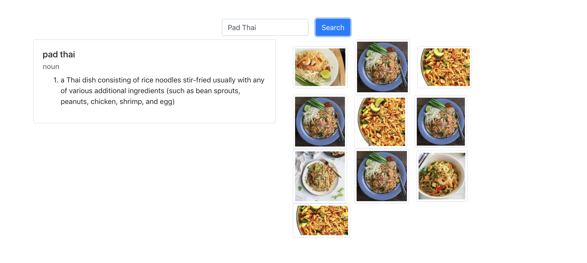
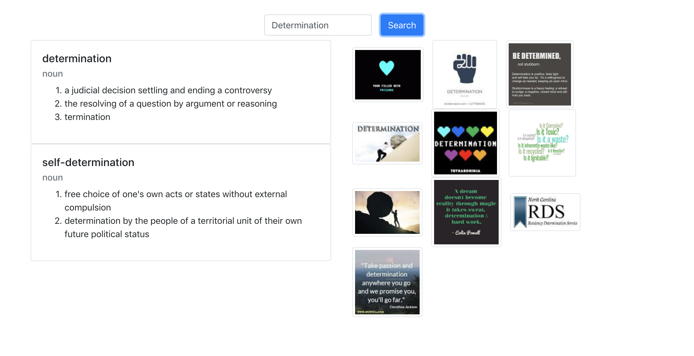
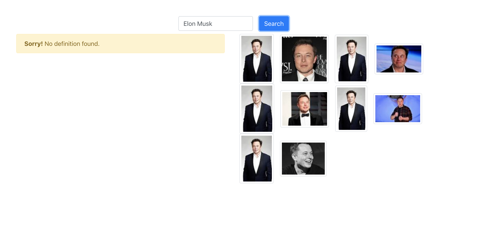

# Image Dictionary

This is a web application that can look up word definition and images related to that word at the same time. The web application can be found [here](https://image-dictionary.netlify.app/)

It is implemented with React, Merriam-Webster Dictionary API, and Google Custom Search API (for images).

This repo is not maintained anymore. I have seperated the repo into 2 different repos to include more features and backend (Django).

[Frontent (React)](https://github.com/newsatit/image-dictionary-frontend)

[Backend (Django)](https://github.com/newsatit/image-dictionary-backend)

## Run
to run the application locally, run 
    
    yarn start 

in the `frontent` directory. 

The application will be availble on `http://localhost:3000/`.

These are some example screenshots of the application:

 

